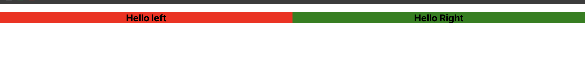
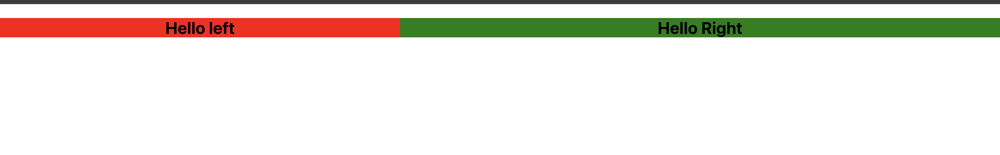
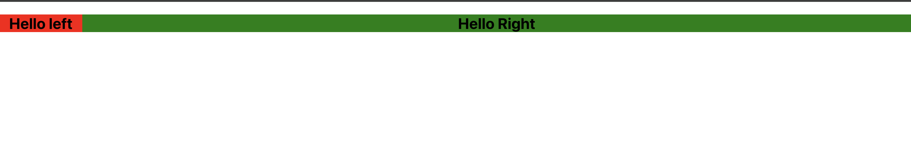
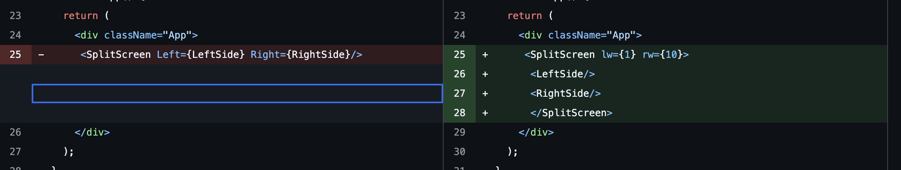
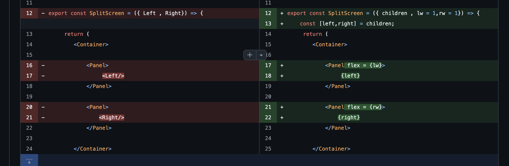

# SplitScreen Component

This `SplitScreen` component is a reusable layout utility that allows you to create a two-panel split-screen layout with customizable widths. It's built using `styled-components` for easy styling and flexibility.

## Installation

Before using the component, make sure to install `styled-components` by running:


npm install styled-components


    used to show 
       [    left   |  right    ]
    
    - uses flex property 
# basic split screen [demo]


we add left width and right width to it and now we can dynmically generate different sizes 

test - 1
 <SplitScreen Left={LeftSide} Right={RightSide} lw={2} rw={3}/>
 

 test - 2 
<SplitScreen Left={LeftSide} Right={RightSide} lw={1} rw={10}/>
 

 -- instead of passing left and right side we can pass them as children 


 

 

 # split screen final code 

```bash
import styled from "styled-components"

const Container = styled.div`
  display : flex;
`;

const Panel = styled.div`
   flex : ${(p) => p.flex};
`


export const SplitScreen = ({ children , lw = 1,rw = 1}) => {
    const [left,right] = children;
     return (
        <Container>
         
            <Panel flex = {lw}>
                 {left}
            </Panel>

            <Panel flex = {rw}>
                {right}
            </Panel>

        </Container>
     )
}


=========================================


#List Item Component